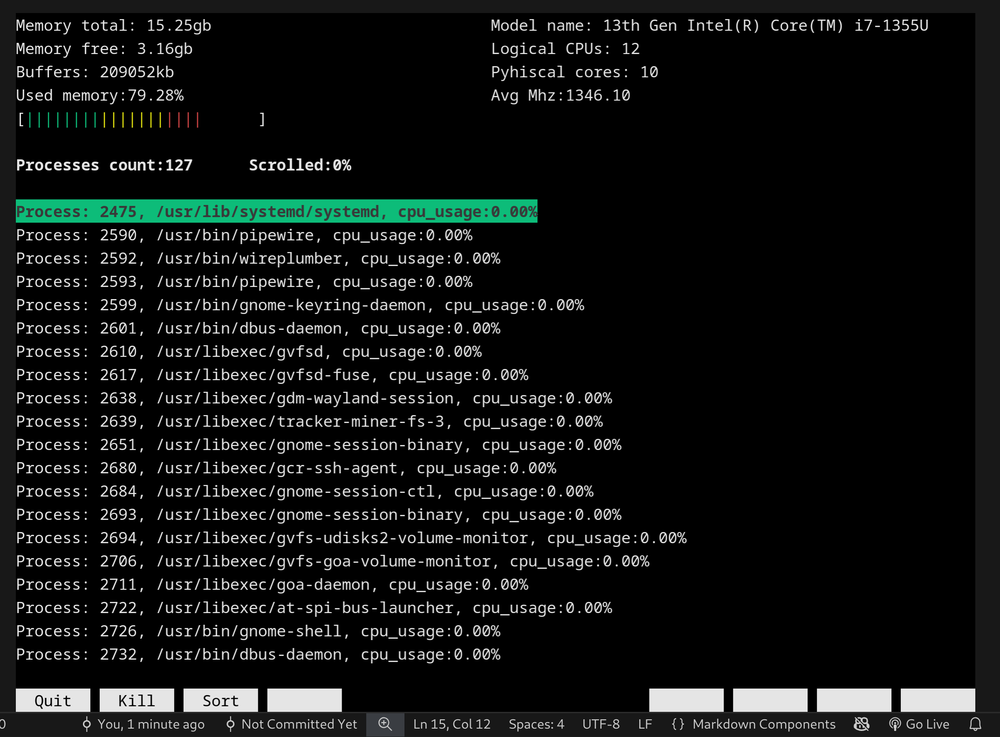

## Features

### 🖥️ Resource Monitoring

- **Memory Usage**

  - Total and free memory display
  - Memory usage percentage
  - Visual memory usage bar
  - Buffer information

- **CPU Statistics**

  - Real-time CPU usage
  - Model information
  - Core details
  - Dynamic updates

- **Process Management**
  - Live process list
  - Process navigation
  - Process details (PID, name, status)
  - Interactive process selection

### 🎨 User Interface

- **Multi-window Layout**

  - Separate windows for different metrics
  - Clean border separation
  - Organized information display

- **Interactive Features**
  - Keyboard navigation
  - Scrollable process list
  - Color-coded information

### 🔧 Technical Features

- Multi-threaded architecture
- Real-time updates
- Thread-safe operations
- ncurses-based UI
- Efficient process monitoring
- Linux system integration

## Architecture

### Components

- **Core Modules**
  - Memory monitoring
  - CPU statistics
  - Process management
- **UI Components**

  - Window management
  - User input handling
  - Display rendering

- **Context Management**
  - Thread synchronization
  - State management
  - Resource cleanup

## Building

### Prerequisites

- GCC compiler
- ncurses library
- uthash
- Linux-based system
- Make utility

### Compilation

```bash
make clean
make
```

### Running

```bash
./bin/index
```

## Usage

### Navigation

- Arrow keys: Navigate process list
- Q: Quit application

### Windows

- Memory information (top-left)
- CPU statistics (top-right)
- Process list (bottom)

## Implementation Details

The project uses:

- ncurses for terminal UI
- POSIX threads for concurrency
- Linux proc filesystem for system data
- uthash for hash table operations

## Acknowledgment

This project is for learning purposes, it is inspired by htop & btop

## Author

[Mohammed Abdulaziz] -->

Here is a clean, professional, and well-structured `README.md` for your project. I have organized the technical details to highlight the impressive performance optimizations while keeping the user instructions simple.

---

# Warden

**Warden** is a high-performance, lightweight terminal task manager for Linux, built using **C** and **Ncurses**. It provides real-time system monitoring and process management with an extremely low resource footprint.



---

## 🚀 Key Features

- **CPU Monitoring:** Real-time visualization of overall CPU usage and individual core performance.
- **Memory Stats:** Detailed breakdown of Total, Available, Free, and Buffered memory.
- **Process Viewer:**
  - View detailed info: `PID`, `Threads`, `CPU%`, `Name`, and `User`.
  - **Kill Processes:** Terminate unwanted processes directly from the UI.
- **Sorting:** Support for default sorting and sorting by CPU usage.

---

## ⚡ Performance & Optimization

Warden is designed to be lighter than the processes it monitors.

- **Resource Usage:** Consumes only **0.1% - 0.6%** of CPU.
- **Caching Strategy:**
  - **File Descriptors:** Heavily used descriptors are cached during initialization to reduce syscall overhead.
  - **Data Structures:** Uses **hash tables** (via `uthash`) for O(1) lookups.
    - _Processes Table:_ Stores process positions.
    - _Y-to-PID Map:_ Maps the UI cursor's vertical position ($y$) directly to the corresponding process entry for instant interaction.

---

## 🏗️ Architecture

The codebase follows a **hybrid MVC and Feature-based** architecture.

### Structure

- **Modular UI:** Each UI block is treated as a standalone feature containing its own `index` and `helpers` file.
- **Main Components:**
  1.  **Context:** Manages application state.
  2.  **UI:** Handles rendering and layout.
  3.  **Core:** Manages system data fetching and logic.

### Concurrency

Warden is **multi-threaded** to ensure the interface remains buttery smooth even under load.

- **Threads:** Separate threads for **Rendering** and **Interactivity**.
- **Sync:** Uses a "Ping-Pong" synchronization style to coordinate safely between the UI and data threads.

---

## 🛠️ Installation

### Dependencies

- **Linux**
- **Ncurses** library
- **uthash** (Macro-based hash table for C structures)

### Build Instructions

Warden includes a `Makefile` for automated building and installation.

```bash
# Clone the repository
git clone https://github.com/yourusername/warden.git
cd warden

# Compile and Install
make
sudo make install
```

### Usage

Run the application from your terminal:

```bash
warden
```

---

## 🔮 Roadmap

- [ ] **Memory Sorting:** Ability to sort processes by RAM usage.
- [ ] **CLI Options:** Support for command-line arguments and flags.

---
